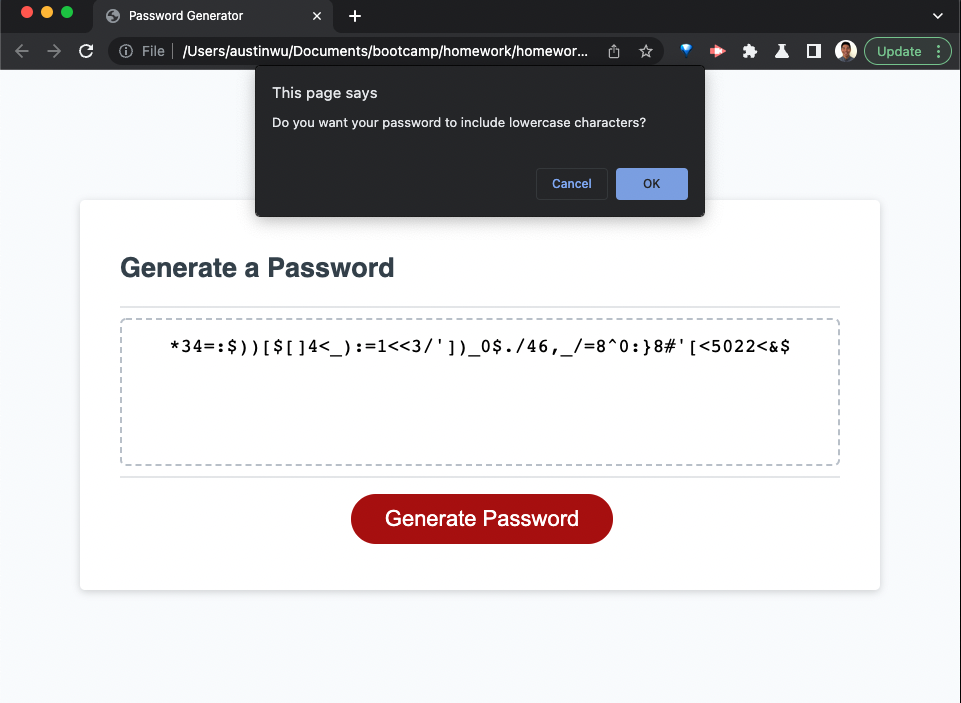

# JS-password-generator

## Goal
The goal of this assignment was to create a random password generator. Given an HTML and CSS source code, I coded a .js script that upon clicking a button on the screen, prompted the user for their desired password criteria, and used their input to generate a random password. The password is then displayed in the text box on the web page. This process can be repeated as many times as the user wants and will generate a new password each time.

https://austibb.github.io/JS-password-generator/

https://github.com/austibb/JS-password-generator